# HypnoViz (Hypnosis)

A trippy music visualizer for Windows. Drop in a song and a spiral reacts to the bass, kicks and snares. Drop in videos, GIFs or images and they blend into the visuals and change scene on the beat.

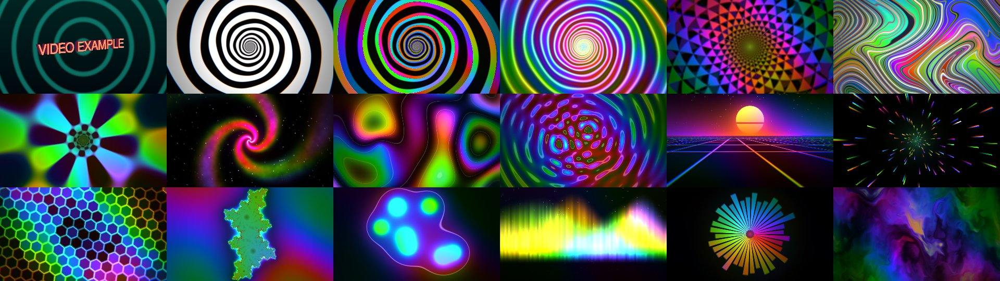
*The 18 styles, left to right and top to bottom: Media (the built-in example clip), Classic, Prism, Neon, Kaleidoscope, Psychedelic, Tunnel, Vortex, Plasma, Ripples, Synthwave, Warp, Honeycomb, Julia, Lava, Aurora, Sunburst and Smoke.*

- 18 visual styles: Media (first), Classic, Prism, Neon, Kaleidoscope, Psychedelic, then Tunnel, Vortex, Plasma, Ripples, Synthwave, Warp, Honeycomb, Julia, Lava, Aurora, Sunburst and Smoke. Media shows your footage only (with an empty stack it plays a built-in example clip: a spinning 3D "VIDEO EXAMPLE" that bounces around like the DVD idle logo, over 5 different animated backgrounds that act as scenes, so every media effect, scene jump and transition shows without a real clip. The Media card in the style picker shows it too, including on hover. It disappears as soon as a real clip is added and comes back when the stack is empty again)
- Media layer: stack videos, GIFs and images; scene changes on the beat, kick or snare; optional smooth video (in-between frames) and camera sway
- Scene manager: preview every detected scene in a clip, trim it, hide or delete the ones you don't want
- A home screen with your saved projects (with snapshots), a missing-files check when you open one, and save / load in Settings
- A glass menu (Esc) with a live preview, a player bar, presets, Domination Mode (popup text) and Spotify Mode (listens to Spotify only, with album art, volume and seeking)

## Requirements

| | |
|---|---|
| OS | Windows 10 or 11 (64-bit) |
| Python | 3.11 (the version this project is developed and tested on). Needs to be on your PATH |
| Graphics | A GPU / driver with OpenGL 3.3 support (any recent NVIDIA, AMD or Intel GPU) |
| Internet | To install the Python packages the first time. Spotify Mode also uses it to look up album art |

The Python packages are listed in `requirements.txt` and are installed for you automatically:
`pygame`, `moderngl`, `numpy`, `miniaudio`, `sounddevice`, `opencv-python`, `Pillow`, `av` and, on Windows only (for Spotify Mode), `proc-tap` (hears Spotify), `pycaw` (Spotify volume) and `winrt-*` (Spotify progress bar and seeking).

You do **not** need conda, ffmpeg or anything else. Everything is installed into a private virtual environment (`.venv`) inside the project folder, so nothing touches your system Python.

## First-time install

1. **Install Python 3.11** from [python.org](https://www.python.org/downloads/windows/). On the first installer screen, tick **"Add python.exe to PATH"**.
2. **Get the project**: click the green **Code** button on GitHub, then **Download ZIP**, and unzip it somewhere (for example `C:\HypnoViz`). Or clone it with git:
   ```
   git clone https://github.com/kitzaroo/HypnoViz.git
   ```
3. **Double-click `run.bat`.**

That's it. The first launch creates the `.venv` folder and downloads the packages, which takes a few minutes. A console window shows the progress. After that, `run.bat` starts the app right away.

If something goes wrong, the console window stays open and shows the error. The most common cause is Python not being on your PATH. Reinstall Python with the PATH box ticked, then run `run.bat` again.

### What the batch files do

| File | What it does |
|---|---|
| `setup_env.bat` | Creates the `.venv` virtual environment and installs `requirements.txt`. Only reinstalls when `requirements.txt` changes. You normally never run this yourself, because the two files below call it first. |
| `run.bat` | Runs `setup_env.bat`, then starts the app. This is the one you use day to day. |
| `build_exe.bat` | Runs `setup_env.bat`, then builds a standalone `.exe` with PyInstaller into `dist\Hypnosis\`. |

## Using it

1. Run `run.bat`. You start on the **home screen**: open a saved project, start a new one, or drag music files onto the window.
2. Drag a music file (mp3, wav, flac, ogg, m4a, aac, opus, ...) onto the window. Drag videos, GIFs or images on as well to add them to the media stack.
3. Press **Esc** to open the glass menu. It fades in with a blur, and every page shares the player bar at the bottom. The header has the tabs, a **home** button (back to the home screen) and a **save** button (save the project).

### Home screen and projects

The app opens on a glass **home screen**. It lists your recent projects as cards with a snapshot of the visuals, the number of tracks and clips, and when you last opened them. Click a card to open it.

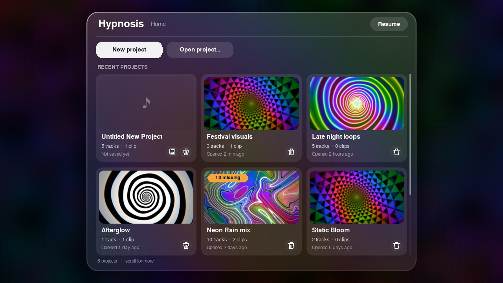

- **New project** starts empty (default settings). **Open project...** picks a `.hypno` file from anywhere. The **Resume** button in the top-right corner (shown once you've started something) goes back to the menu tab you left (it doesn't close the menus). A project that hasn't been saved yet appears first in the list as an "Untitled New Project" card (click it to resume; its save icon saves it as a project, its trash icon discards it after asking); it is only there for the session and disappears when you close the app without saving.
- Dropping music or video files on the home screen starts right away. Dropping a `.hypno` file opens that project. Launching the app with files (or a `.hypno` file) skips the home screen.
- The small **x** on a card (shown on hover) only removes it from the list. It never deletes the project file.
- Closing the app (the window's close button, **Exit app** in Settings, or **Q**) with unsaved changes first asks **Save**, **Don't save** or **Cancel**. With an unsaved new session, Save asks where to save it.
- The **trash** icon at the bottom right of a card permanently deletes that one project file, after an "are you sure" prompt (**Cancel** is the highlighted choice). It never touches your music, videos or any other project.
- Press the **house button** in the menu header (or **Home** in Settings > Project) to come back to the home screen. Your session stays running, so **Resume** returns to it.
- A project keeps your queue and current track, your media stack, the scene trims / hidden / deleted scenes for those clips, every setting (style, sliders, toggles) and whether **Spotify Mode** was on (opening the project switches it back on). It does **not** store the volume or display mode.
- Projects live in `%APPDATA%\Hypnosis\projects` by default, but you can save them anywhere. Opening or replacing a session with unsaved changes asks **Save changes?** first. Closing the app does not save for you.

**Missing files.** A project only stores where your files are. When you open one, Hypnosis checks that they still exist. If some don't, a warning lists exactly which ones are missing and lets you choose:

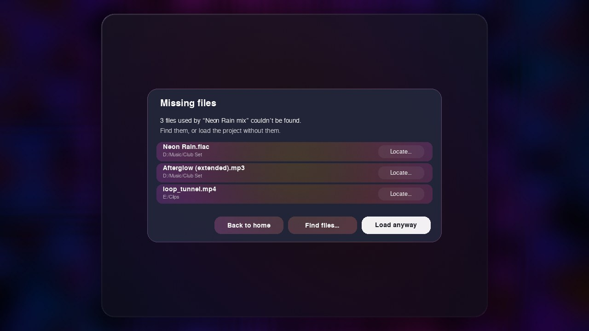

- **Back to home**: don't open it.
- **Find files...**: pick a folder and Hypnosis searches it (and everything inside) for the missing file names. You can also use **Locate...** next to a single file.
- **Load anyway**: open the project without those files. They stay recorded in the project, so saving never forgets them, and they come back once the files are back in place.

### The menu

**Queue**: your playlist. Click a track to play it, reorder or remove tracks, shuffle or clear what's coming up, loop the queue.

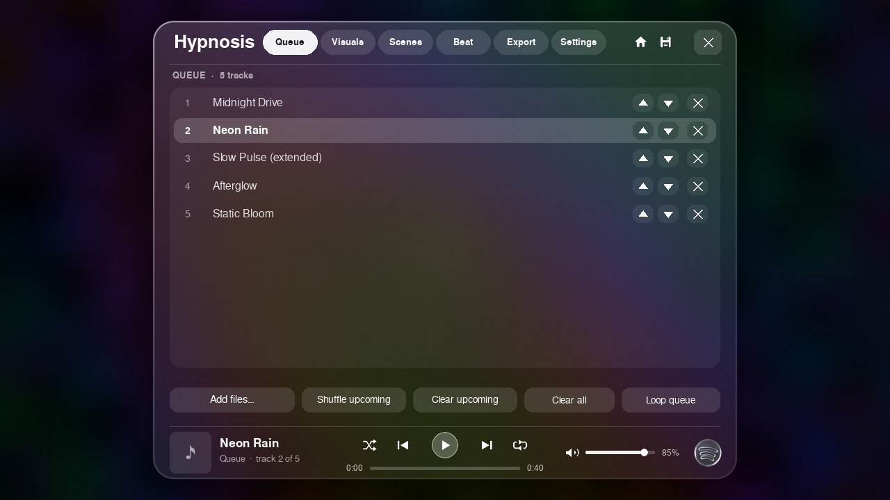

**Visuals**: one scrolling page of collapsible sections.

- *Visual style*: the style cards in one row. Scroll the row with the mouse wheel (over it) or drag the scroll bar under it (every list's scroll bar can be grabbed and dragged too: page, queue, scenes, media stack, projects); cards blur and fade at the row's edges as they scroll in and out. Hover a card and it plays a short looping demo of that style.
- *Live preview*: a mirror of what's on screen. Scroll down and it blurs away, then blurs back in as a mini preview in the bottom left of the player bar (over the art and song name), so you can keep watching it while you edit the sliders below. Scroll back up and it hands itself back.
- *Motion & effects*: spin, bass zoom, bass distortion, chromatic aberration, smoothing, colour drift, beat pulse (how hard the media layer pulses with the bass) and (only while Domination mode is on) the Domination text size / rate sliders. **Bass zoom style** picks how the Bass zoom slider moves the picture: **Centered zoom**, **Shaky zoom** (the zoom trembles, harder the further in it goes) or **Random area zoom** (each new bass swell glides the zoom toward a different spot on the screen). **Bass distortion style** picks what the Bass distortion slider (just under Bass zoom) does on every bass / kick hit: **Blur**, **Vibrate**, **Glitch** (the Domination banner's tearing, inverted bars and colour split, across the whole screen) or **Random** (a different one on each hit). The slider sets how strong it is and starts at 100% (0% turns it off). Every effect slider has a light on its left: click it to switch that effect off (the slider greys out and the effect counts as zero; Domination size / rate count as 100%) and click again to turn it back on. The Kaleidoscope zoom speed slider only shows while the Kaleidoscope style is selected. New projects start with Spin response 40%, Bass distortion 100%, Colour drift 300% and Scene change rate 30%. Under the **Media effects** heading are the media blend mode (spiral window, soft overlay, glow), beat-reactive opacity, kick/snare burst and flash, camera sway, scene change rate, transition style and **Smooth video**.
- *Media & stack*: the current clip with **Add files...**, **Scenes...** and the **Media layer** on/off switch, plus the stack of every clip. Click a clip to jump to it.

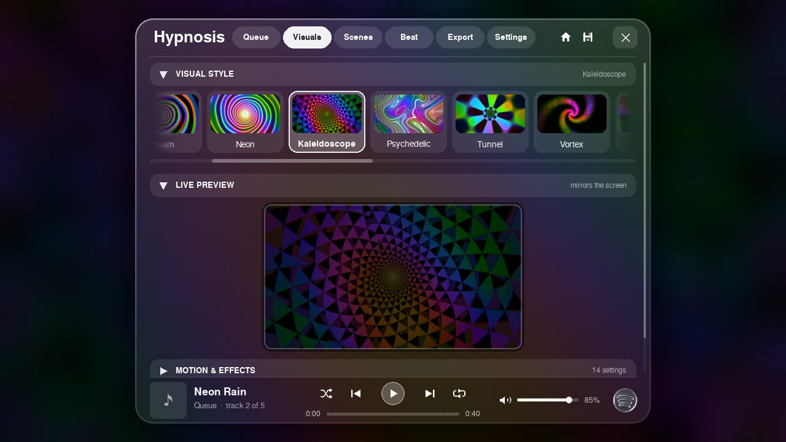
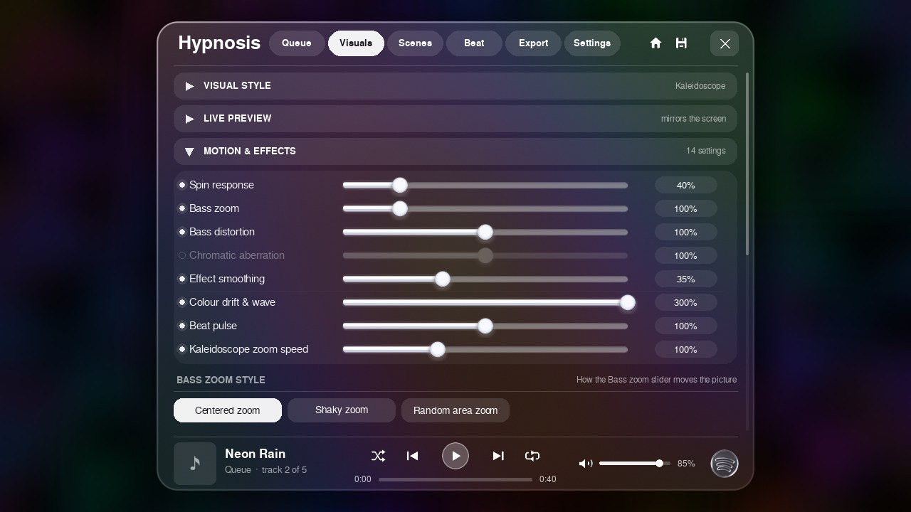
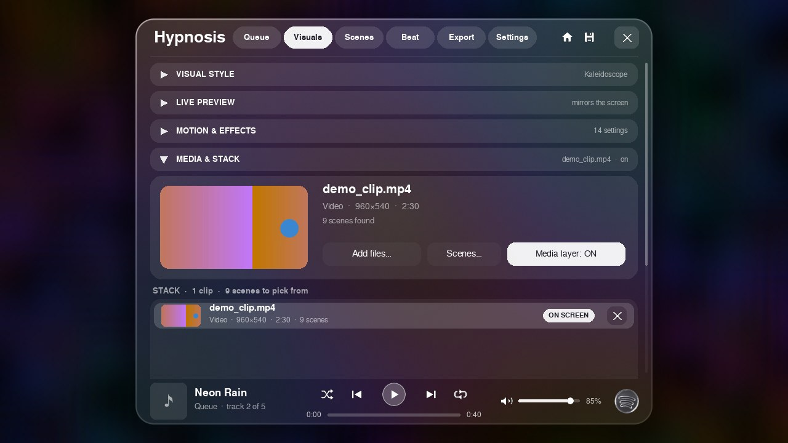

**Scenes**: every scene detected in a clip. Click one to loop it in the preview, drag the two handles under the preview to trim it (shorten or lengthen), and hide or delete scenes you don't want.

- The **arrows** on each row move a scene up or down the list.
- **Play in order** plays the scenes top to bottom (all clips in stack order, each clip's scenes in its list order) and loops. **Random** is the default shuffle.
- After trimming, **Save as new scene** adds that trimmed range to the list as its own scene (named *Cut 1*, *Cut 2*...) right below the original, and puts the original back to full length. You can then trim, hide, delete or move the cut like any other scene.
- Everything is remembered: trims, hidden / deleted scenes, cuts and their order. The scene list itself is remembered too (`scancache.json`), so a clip is only scanned once. Settings has a **Clear all scene cache** button (click twice to confirm) that forgets every remembered scene list except the clips loaded right now, so an old video you add later gets the Loading Scenes screen and a fresh scan. While a newly added video is being scanned, a full-screen "Loading Scenes" cover (a softly blurred Psychedelic picture that blurs in when it comes up and blurs out when done) shows a progress bar, the percentage and how many scenes were found so far (with several videos added at once it also says "Video 2 of 3" and follows each one in turn: media is loaded and scanned strictly one at a time, in the order it was added: the bar fills for the first video, then resets and starts over for the next); when every scene is known, playback restarts from scratch so nothing starts half-prepared. Projects save the scene list and all these edits with them, so opening a project brings back your scenes instantly instead of rebuilding them.

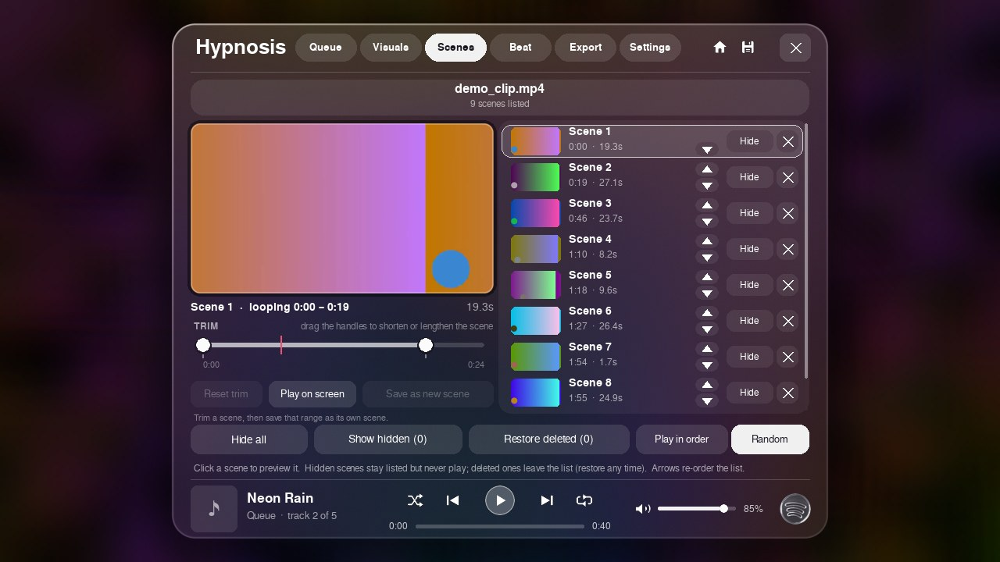

While a new video is scanned, the "Loading Scenes" cover takes over the screen:

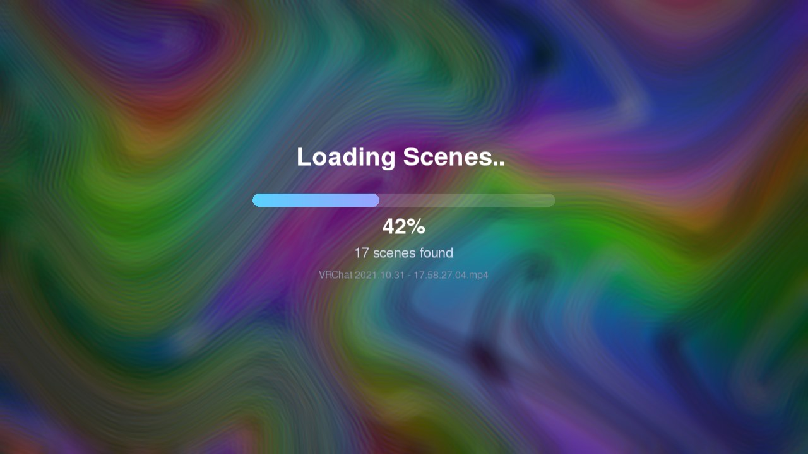

**Beat**: a live spectrum with the kick and snare bands. Tune the ranges and sensitivities until KICK and SNARE flash only on the real drums.

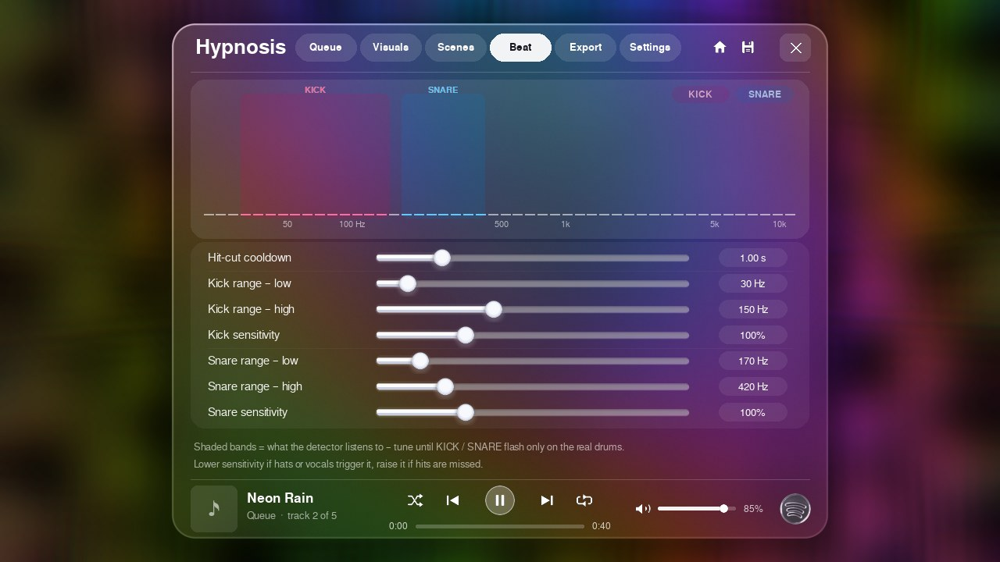

**Export**: records what you see, without the menu, together with the song's own audio, into a video file. Pick the resolution (720p to 4K), frame rate (24/30/60), quality, format (MP4, MKV or WebM), whether to start from the beginning or from where the song is now, a length (whole song, 30 s, 1 min, 2 min), 16:9 or the window's own shape, and whether to include the song. Files go to `Videos\Hypnosis` by default (**Change...** picks another folder, **Open folder** shows it). Everything in the scene is captured: the style, effects, media layer and domination popups. A live preview sits beside the options so you can watch it render, and the menu's audio low-pass is turned off on this tab so you hear the song clearly. It works in real time, so a 4 minute song takes about 4 minutes; pausing pauses the recording, and skipping or changing songs ends it (the file up to that point is kept). It needs a loaded song and does not work in Spotify Mode. **GPU encoding** uses an NVIDIA card when available (falls back to the CPU encoder otherwise).

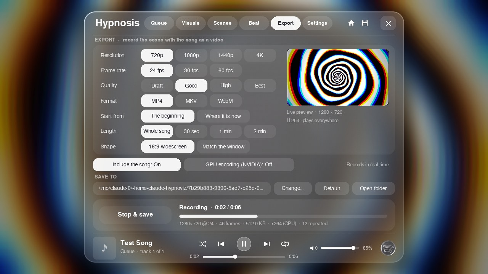

**Settings**: the **Domination Mode** and **Spotify Mode** switches, display mode (windowed, borderless, exclusive fullscreen), help hints, remembering your media on startup, the Spotify sync delay, the **Project** box (**Save project**, **Save as...**, **Load project...**, **Home**), presets (save, update, delete) **Reset all settings** and **Clear all scene cache**. The keys are listed in a single line under the Project box and in the table below.

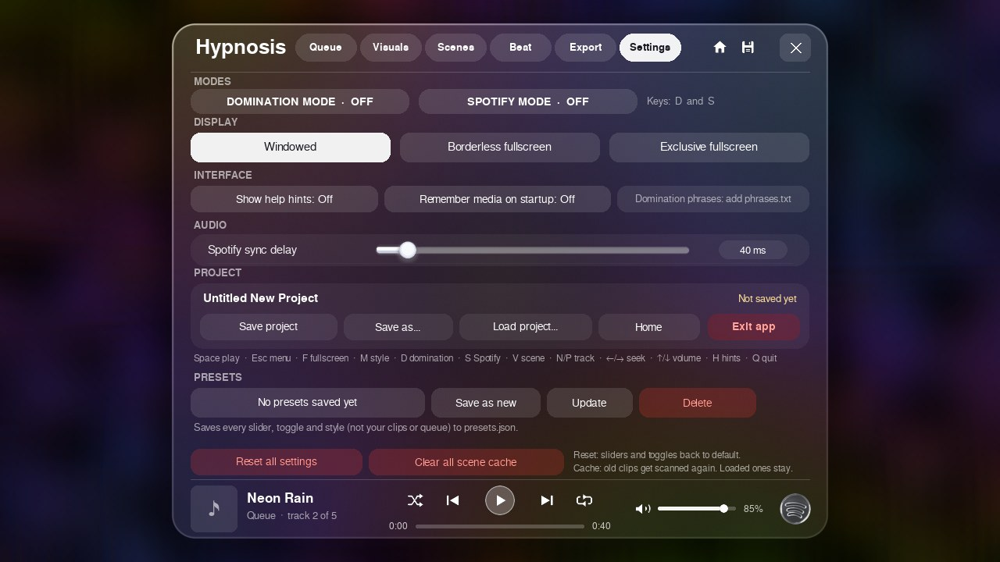

### The player bar

At the bottom of every page: the current song, shuffle, previous, play/pause, next, repeat, a seek bar with times, a volume slider, and the glass Spotify button.

- **Shuffle** shuffles the upcoming tracks, **Repeat** loops the queue.
- Click the glass Spotify button to turn Spotify Mode on (it washes green in a colourful wave) or off (it fades back to grey).

### Spotify Mode

Spotify Mode makes the visuals react to the Spotify desktop app instead of your own files. Spotify must be installed, open and playing.

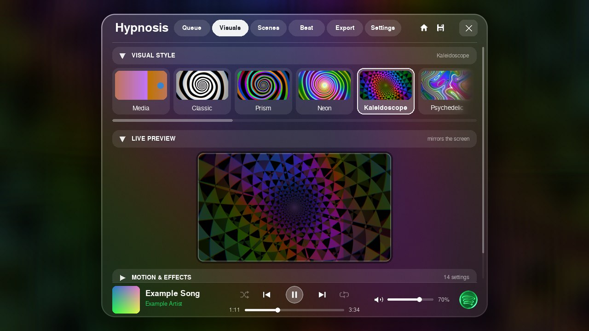
*(The screenshot uses placeholder song info and album art.)*

In Spotify Mode the player bar shows Spotify's song, artist and album art, and:

- previous, play/pause and next control Spotify
- the **volume** slider sets Spotify's own volume in the Windows mixer (needs `pycaw`; Spotify must have played something so its audio session exists)
- the **progress bar** shows the track position and you can click or drag it to jump around (needs the `winrt` packages)
- the song name and artist stay on screen while the song is paused
- the album art is looked up online from the song name, so it can occasionally be a different release or missing (a green note is shown then)
- shuffle and repeat are greyed out, because Spotify can't be asked to change those

`setup_env.bat` installs those packages for you. If one is missing, the matching control tells you which to install.

`spotify_icon.png` (next to the program) is the picture used for the glass Spotify button. Without it a plain glass disc is drawn instead.

### Keys

| Key | Action |
|---|---|
| Space | Play / pause |
| Esc | Open / close the menu (close a pop-up first, if one is open) |
| F or F11 | Fullscreen |
| M or Tab | Next visual style |
| V | Next media scene |
| X | Hide the scene on screen (it never plays again; menu closed) |
| Delete | Delete the scene on screen (menu closed) |
| Z | Undo the last hide / delete (menu closed) |
| Mouse wheel (menu > Visuals) | Scroll the page; over the style cards it scrolls the row sideways; Ctrl + wheel over a slider nudges it |
| D | Domination Mode |
| S | Spotify Mode |
| N / P | Next / previous track |
| Left / Right | Seek 5 seconds |
| Up / Down or mouse wheel | Volume (menu closed) |
| H | Show / hide the help text |
| Q | Quit |

Your settings, presets, trims, hidden/deleted scenes, the recent-projects list and your projects (`projects\*.hypno`) are saved in `%APPDATA%\Hypnosis`.

## Building a standalone .exe

Double-click `build_exe.bat` (the exe gets the spiral icon from `hypnosis_icon.ico`). When it finishes, the app is in `dist\Hypnosis\Hypnosis.exe`.

Keep the whole `dist\Hypnosis` folder together: `Hypnosis.exe` needs the `_internal` folder next to it (and `spotify_icon.png`, which the build copies there). To share it, zip that folder. The people you share it with need **no** Python and no setup, they just unzip it and run `Hypnosis.exe`.

## Updating

Replace the files with the new version (or `git pull`) and run `run.bat` again. If `requirements.txt` changed, the packages update automatically.

## Troubleshooting

- **"Could not create the virtual environment"**: Python isn't installed or isn't on your PATH. See step 1 above.
- **Videos don't play**: make sure the packages finished installing. Delete the `.venv` folder and run `run.bat` again to reinstall.
- **Spotify Mode hears nothing**: it listens to the Spotify desktop app only, so Spotify must be open and playing.
- **Spotify volume or the progress bar does nothing**: the `pycaw` / `winrt` packages are missing. Run `setup_env.bat` (or delete `.venv\requirements.installed` and run `run.bat`). The volume slider also needs Spotify to have started playing at least once.
- **Album art is wrong or missing**: it is matched by song name from an online music search, so rare or renamed tracks may not match.
- **Slow with big videos**: turn off **Smooth video** in Visuals > Motion & effects (under Media effects).
